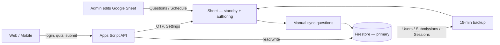
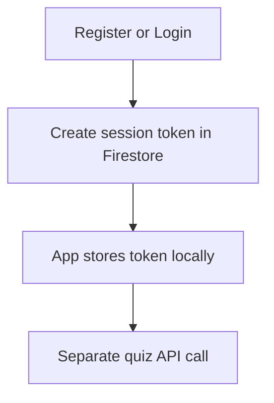
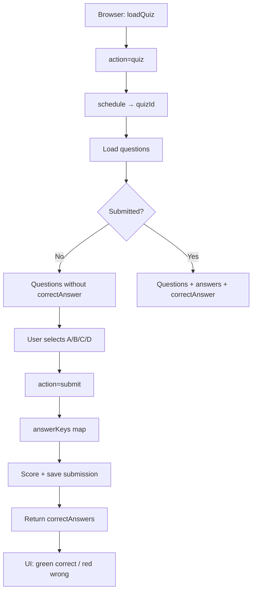

# BBA Dublin Bible Quiz — How the app works

This is the **entire application flow** document. Anyone joining the project can read this file to understand architecture, data, user journeys, admin tasks, APIs, and deploy.

**Keep this doc updated** when behaviour changes (see `.cursor/rules/app-flow-docs.mdc`).

---

## 1. What it is

**BBA Dublin Bible Quiz** is a daily Bible chapter quiz for Believers Brethren Assembly Dublin.

| Who | What they do |
|-----|----------------|
| **Students** | Register / sign in, take today’s quiz (English or Malayalam), submit once, see right/wrong, view scoreboard and profile/badges |
| **Admins** | Edit questions in Google Sheet, sync to Firestore, manage Firebase/settings, use the **BBA Quiz** sheet menu |

**Live site (typical):** `https://www.quiz.bbadublin.com/`  
**Timezone:** Europe/Dublin (quiz day resets at local midnight)

---

## 2. Big picture

| Layer | Technology | Role |
|-------|------------|------|
| Authoring + standby | Google Sheet + bound Apps Script | Questions, schedule, Settings; backup of users/submissions/sessions |
| Backend API | Apps Script Web App (`/exec`) | Auth, quiz, submit, leaderboard, profile |
| Primary database | Cloud Firestore (`bbadublin-quiz`) | Quiz content + runtime user data |
| Web UI | Firebase Hosting (`web-frontend/`) | Static app calling the API |
| Same UI (optional) | Apps Script `index.html` | Served from `doGet` / Google Sites embed |
| Mobile | Flutter WebView | Opens the same quiz URL |
| Optional (Blaze) | Cloud Functions | `/api` proxy; optional sync URL |

---

## 3. Where data lives

| Data | Source of truth | Notes |
|------|-----------------|--------|
| Questions + correct answers | **Sheet** (authoring) → **Firestore** after manual sync | Collections: `questions`, `answerKeys`, `quizPacks` |
| Daily schedule | Sheet → Firestore | `schedule/{yyyy-MM-dd}`, `quizzes/{quizId}` |
| Users (password hash, stats) | **Firestore** | Sheet kept as standby backup |
| Submissions (answers, score, locked) | **Firestore** | One locked submit per user per quiz date |
| Sessions | **Firestore** | Created on login; Sheet backup |
| OTP codes | **Sheet only** | Short-lived; not in Firestore |
| Settings | **Sheet** `Settings` tab | `key` / `value` rows |
| Badges | Computed in code | From `CONFIG.BADGE_RULES` + user stats |

---

## 4. Sync model (admin)

| Direction | What | When |
|-----------|------|------|
| **Sheet → Firestore** | Questions, answer keys, schedule, quizzes | **Manual only** — menu: *Sync questions to Firestore* |
| **Firestore → Sheet** | Users, Submissions, Sessions | Every **15 minutes** (backup) or *Backup now* |
| **Sheet → Firestore** (once) | Existing users/submissions/sessions | *Migrate runtime data to Firestore* |
| **Repair stats** | Recalc `totalScore`, `totalQuizzes`, `perfectScores`, `streak` from submissions | *Recalculate user stats from submissions* |
| **Reset season** | Delete all submissions; zero scores/streaks; disable test date picker | *Delete all submissions & reset scores* |
| **Go live** | Today-only quiz (no test date picker) | *Go live (disable test date picker)* or Settings `test_date_picker` \| `false` |

There is **no** automatic Sheet → Firestore sync for questions. After editing questions in the Sheet, an admin must run the manual sync.

More detail: [FIRESTORE-SPARK.md](./FIRESTORE-SPARK.md), [FIRESTORE-HYBRID.md](./FIRESTORE-HYBRID.md).

---

## 5. Student journeys

### 5.1 Register and sign in

| Path | API action | Behaviour |
|------|------------|-----------|
| Register | `register` | Create user (Firestore + Sheet standby), return session token |
| Password login | `login` | Verify hash (Firestore first, Sheet fallback), create session |
| Email OTP | `requestOtp` → `loginOtp` | 6-digit code emailed; stored in OTP sheet (~10 min) |
| Forgot password | `forgotPassword` | Temp password emailed; `mustChangePassword = true` |
| Change password | `changePassword` | Required when must-change flag is set |

**Remember me:** longer session (client `localStorage` vs `sessionStorage`).  
**Logout:** client clears token only (no server logout action).  
**Sign-in does not load the quiz** — quiz is a separate request (faster login).

### 5.2 Take the daily quiz

1. App calls `quiz` with session token (+ language, optional test `quizDate`).
2. Server resolves date (today in Dublin, or test date).
3. Reads `schedule/{date}` → `quizId`.
4. Checks for an existing **locked** submission.
5. Loads questions (cache → `quizPacks` → `questions` query → Sheet fallback).

| Quiz state | Client receives |
|------------|-----------------|
| **Open** | Questions + options A–D — **no** correct answers (anti-cheat) |
| **Already submitted** | User answers + correct answers + score; UI locked |

User answers locally (`selectedAnswers`). All questions must be answered before submit.

### 5.3 Submit and see right / wrong

1. Client calls `submit` with `{ token, answers, language }`.
2. Server loads **answer key map** from Firestore `answerKeys` (cached / pack / Sheet fallback).
3. Compares each pick to the key → score (`POINTS_PER_CORRECT`, currently **1** per correct).
4. Writes locked `submissions/{email_date}` and updates `users` stats.
5. Returns `score`, `answers`, and **`correctAnswers`**.
6. UI merges keys onto questions and re-renders:
   - **Green** (`.correct`) = right answer
   - **Red** (`.incorrect`) = user’s wrong pick

Re-submit of a locked quiz is rejected.

### 5.4 Scoreboard and profile

| Feature | API | Source |
|---------|-----|--------|
| Scoreboard | `leaderboard` (`daily` / `weekly` / `monthly` / `all`) | Firestore users/submissions (Sheet fallback) |
| Profile + badges | `profile` | User stats + rank + `CONFIG.BADGE_RULES` |

After submit, scoreboard should show new totals immediately (Firestore). If totals look wrong historically, run **Recalculate user stats from submissions**.

---

## 6. Quiz load → score → review (detail)

### Collections used in this path

| Collection | Contents | When |
|------------|----------|------|
| `schedule` | date → quizId | Load |
| `questions` | text + options | Load |
| `answerKeys` | correct letter only | Submit / score |
| `quizPacks` | cached pack (server) | Faster load |
| `submissions` | user answers, score, locked | Submit / reload |
| `users` | totals for scoreboard | After submit |

**Code:** `gas/Quiz.gs`, `gas/FirestoreRest.gs`, `gas/index.html` / `web-frontend/app.js`

---

## 7. Admin journeys (BBA Quiz menu)

From the Google Sheet menu **BBA Quiz**:

| Menu item | Purpose |
|-----------|---------|
| Run initial setup | Create sheet tabs + sample data |
| Refresh schedule from Questions | Rebuild `DailySchedule` |
| Validate upcoming quizzes | Ensure enough questions (EN + ML) |
| Sync questions to Firestore (manual) | Push Q&A + schedule to Firestore |
| Continue / Reset paused Firestore sync | Resume after Apps Script time limit |
| Migrate runtime data to Firestore | One-time users/submissions/sessions |
| Recalculate user stats from submissions | Fix totals/streak from locked submits |
| Delete all submissions & reset scores | Wipe submissions; zero scores; disable test picker |
| Go live (disable test date picker) | Today-only quiz (no test date picker) |
| Backup Firestore → Sheet now | Immediate standby refresh |
| Install 15-min Firestore → Sheet backup | Scheduled standby |
| Remove auto sync / backup triggers | Clear triggers |
| Authorize Firebase access / Test connection | OAuth / connectivity |
| Authorize email / Test quiz email | MailApp permissions |
| Test daily welcome / scoreboard emails | Send test to `email_test_recipient` |
| Install daily/weekly email triggers | Scheduled welcome + scoreboards |
| Enable email broadcast to all users | Switch from test to all users |
| Show Google Sites embed URL | Embed + health check URLs |

**Test date picker (testing only):** Settings row `test_date_picker` | `true` (set `false` for live).

---

## 8. API reference

All API traffic goes through Apps Script `doGet` / `doPost` → `handleApi_` (`gas/Main.gs`).  
Hosted UI uses `window.BBA_API_URL` (usually the `/exec` URL or `/api` proxy).

| Action | Auth | Purpose |
|--------|------|---------|
| `register` | — | Create account + session |
| `login` | — | Password login |
| `requestOtp` | — | Send OTP email |
| `loginOtp` | — | OTP login |
| `forgotPassword` | — | Temp password email |
| `changePassword` | token | Change password |
| `quiz` | token | Load quiz for date |
| `submit` | token | Score and lock |
| `leaderboard` | token | Rankings |
| `profile` | token | Stats + badges |
| `ping` | — | Version + public config |

Serving the page (no `action`, or `action=page`) returns the HTML UI from Apps Script.

---

## 9. Configuration

### `gas/Config.gs` (selected)

| Key | Meaning |
|-----|---------|
| `APP_VERSION` | Cache-bust / mobile sync — bump every release |
| `TIMEZONE` | `Europe/Dublin` |
| `QUIZ_DATA_SOURCE` | Default `firestore` (`auto` / `sheet` also valid) |
| `POINTS_PER_CORRECT` | Points per right answer (currently 1) |
| `MIN_QUESTIONS_PER_QUIZ` | Minimum questions before quiz is “ready” |
| `FIREBASE_PROJECT_ID` | e.g. `bbadublin-quiz` |
| `FIRESTORE_AUTH_MODE` | `user` (OAuth) or `service_account` |
| Languages | `en` → Questions, `ml` → QuestionsMalayalam |

Keep `mobile/lib/config/app_config.dart` `appVersion` in sync with `APP_VERSION`.

### Settings sheet (common keys)

| key | value example |
|-----|----------------|
| `firebase_project_id` | `bbadublin-quiz` |
| `firestore_auth_mode` | `user` |
| `quiz_data_source` | `firestore` |
| `test_date_picker` | `true` / `false` |
| `email_broadcast_mode` | `test` (one recipient) or `all` |
| `email_test_recipient` | `kjjaison@gmail.com` |
| `quiz_public_url` | `https://bbadublin-quiz.web.app/` |
| `daily_welcome_hour` | `6` (Dublin, 24h) |
| `daily_scoreboard_hour` | `23` |
| `weekly_scoreboard_hour` | `23` (Saturday) |
| `monthly_scoreboard_hour` | `23` (last day of month) |
| `firestore_sync_url` | (optional Blaze CF URL) |
| `sync_secret` | (optional) |
| `firestore_sync_prune_stale` | `true` to prune old FS docs on sync |

---

## 10. Deploy checklist

1. Copy all `gas/*.gs` + `index` HTML + `appsscript.json` into the Sheet-bound Apps Script project.
2. **Deploy → Manage deployments → Edit → New version → Deploy** (Web App: execute as you, access anyone).
3. Regenerate hosting assets:  
   `powershell -File .\scripts\sync-web-frontend.ps1`
4. Set `web-frontend/config.js` → Apps Script `/exec` URL.
5. Deploy hosting (Spark):  
   `firebase deploy --only hosting --config firebase.spark.json`
6. Deploy rules when changed:  
   `firebase deploy --only firestore`
7. Hard-refresh the site (`?v=` + new `APP_VERSION`).

More: [SETUP.md](./SETUP.md), [FLUTTER.md](./FLUTTER.md), [SHEET-TEMPLATE.md](./SHEET-TEMPLATE.md).

---

## 11. Key files

| Path | Role |
|------|------|
| `gas/Config.gs` | Global config, helpers |
| `gas/Main.gs` | HTTP entry + API router |
| `gas/Auth.gs` | Register, login, OTP, passwords, sessions |
| `gas/Quiz.gs` | Load quiz, submit, streaks |
| `gas/Leaderboard.gs` | Scoreboard + profile badges |
| `gas/Setup.gs` | Sheet setup + **BBA Quiz** menu |
| `gas/FirestoreRest.gs` | Firestore REST client, quiz packs |
| `gas/FirestoreSync.gs` | Manual Sheet → Firestore questions sync |
| `gas/FirestoreRuntime.gs` | Runtime FS users/submissions; migrate; recalculate |
| `gas/FirestoreBackup.gs` | Firestore → Sheet backup + trigger |
| `gas/index.html` | Canonical web UI source |
| `web-frontend/` | Hosted static UI (`app.js`, `styles.css`, `config.js`) |
| `mobile/` | Flutter shell |
| `functions/` | Optional proxy / Blaze sync |
| `scripts/sync-web-frontend.ps1` | Split `gas/index.html` → hosting files |

---

## 12. Related docs

| Doc | Topic |
|-----|--------|
| [SETUP.md](./SETUP.md) | First-time deploy to custom domain |
| [FIRESTORE-SPARK.md](./FIRESTORE-SPARK.md) | Spark Firestore setup, sync, backup |
| [FIRESTORE-HYBRID.md](./FIRESTORE-HYBRID.md) | Schema / hybrid notes |
| [FLUTTER.md](./FLUTTER.md) | Mobile WebView |
| [SHEET-TEMPLATE.md](./SHEET-TEMPLATE.md) | Sheet column layouts |

---

*Last structural update: `2026-07-16.6` — Firestore-primary runtime; manual question sync (invalidates `quizPacks`); 15‑min Sheet backup with empty-guard; login separate from quiz load; submit live-checks lock and returns `correctAnswers` for review.*
