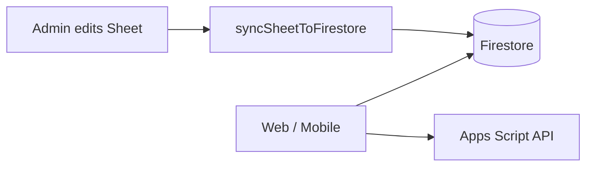

# Hybrid Firebase + Google Sheet

In the **hybrid** model:

- **Google Sheet** — admins edit questions and schedule (same as today)
- **Firestore** — runtime database the app reads for quiz content
- **Apps Script** — still handles login, submit, leaderboard (for now)
- **Cloud Function `syncSheetToFirestore`** — copies Sheet → Firestore *(Blaze plan only)*
- **Apps Script direct sync** — copies Sheet → Firestore *(Spark plan — see [FIRESTORE-SPARK.md](./FIRESTORE-SPARK.md))*



---

## Firestore schema

### `questions/{language}_{quizId}_{questionNum}`

Public quiz questions (no correct answer).

| Field | Example |
|-------|---------|
| `quizId` | `quiz-001` |
| `language` | `en` or `ml` |
| `questionNum` | `1` |
| `question` | Question text |
| `bookReference` | `Genesis 1` |
| `options` | `{ A, B, C, D }` |
| `syncBatchId` | `sync_1710000000000` |
| `syncedAt` | timestamp |

Doc ID example: `en_quiz-001_1`

### `answerKeys/{language}_{quizId}_{questionNum}`

Server-only scoring data (blocked by security rules).

| Field | Example |
|-------|---------|
| `correctAnswer` | `A` |

### `schedule/{yyyy-mm-dd}`

One document per quiz day.

| Field | Example |
|-------|---------|
| `date` | `2026-07-14` |
| `quizId` | `quiz-001` |
| `book` | `Genesis` |
| `chapter` | `1` |
| `title` | `Genesis 1` |

### `quizzes/{quizId}`

Summary metadata per quiz.

| Field | Example |
|-------|---------|
| `title` | `Genesis 1` |
| `questionCount` | `{ en: 6, ml: 6 }` |

### `submissions/{id}` *(future)*

User answers — written by Cloud Functions, not synced from Sheet.

### `users/{email}` *(future)*

Profiles — migrate from Sheet when auth moves to Firebase.

### `syncMeta/latest`

Last sync status (view in Firebase Console).

---

## View / edit Firestore data

1. Open [Firebase Console](https://console.firebase.google.com)
2. Select project **bbadublin-quiz**
3. **Build → Firestore Database → Data**
4. Browse collections: `questions`, `schedule`, `quizzes`, `syncMeta`

You can add/edit/delete documents manually for testing. Production edits should stay in the **Google Sheet**, then run sync.

---

## One-time setup

### 1. Upgrade to Blaze

Cloud Functions require the **Blaze** plan (pay-as-you-go). Quiz traffic is usually near $0.

### 2. Enable Firestore

```powershell
firebase firestore:databases:create --location=europe-west1
```

Or in Console: **Build → Firestore Database → Create database** (production mode, `europe-west1`).

### 3. Configure functions

```powershell
cd functions
copy .env.example .env
# Edit .env:
#   SPREADSHEET_ID = ID from sheet URL (.../d/THIS_PART/edit)
#   SYNC_SECRET    = long random string
#   APPS_SCRIPT_URL = your /exec URL (legacy proxy)
npm install
```

### 4. Share Sheet with Cloud Functions service account

After first deploy, find the service account:

**Firebase Console → Project settings → Service accounts**

Or default: `PROJECT_ID@appspot.gserviceaccount.com`

Share your quiz Google Sheet with that email as **Viewer**.

### 5. Deploy

```powershell
firebase deploy --only firestore,functions
```

Note the sync URL, e.g.  
`https://europe-west1-bbadublin-quiz.cloudfunctions.net/syncSheetToFirestore`

### 6. Settings sheet (in Google Sheet)

Add rows to the **Settings** tab:

| key | value |
|-----|-------|
| `firestore_sync_url` | `https://europe-west1-....cloudfunctions.net/syncSheetToFirestore` |
| `sync_secret` | same as `SYNC_SECRET` in `functions/.env` |

### 7. Copy Apps Script file

Copy `gas/FirestoreSync.gs` into your Apps Script project.

### 8. Run first sync

- **Sheet menu:** BBA Quiz → Sync quiz data to Firestore  
- **Apps Script:** run `syncQuizToFirestoreWithMessage`  
- **curl:**

```powershell
curl -X POST "https://europe-west1-YOUR_PROJECT.cloudfunctions.net/syncSheetToFirestore" `
  -H "X-Sync-Secret: YOUR_SECRET" `
  -H "Content-Type: application/json" `
  -d "{}"
```

Automatic sync runs **every 15 minutes** via Cloud Scheduler (`syncSheetToFirestoreScheduled`).

---

## What stays on the Sheet (for now)

| Sheet tab | Firestore | App reads |
|-----------|-----------|-----------|
| Questions | `questions` + `answerKeys` | Firestore (after app migration) |
| QuestionsMalayalam | `questions` (`language: ml`) | Firestore |
| DailySchedule | `schedule` | Firestore |
| Users | — | Apps Script |
| Submissions | — | Apps Script |
| Sessions | — | Apps Script |

---

## Next step (app reads Firestore)

Point Cloud Function `api` quiz action at Firestore instead of Apps Script for `action=quiz`. Login/submit can stay on Apps Script until Firebase Auth is added.

---

## Troubleshooting

| Error | Fix |
|-------|-----|
| `Missing SPREADSHEET_ID` | Set in `functions/.env`, redeploy |
| `Unauthorized sync request` | Match `sync_secret` in Sheet and `functions/.env` |
| `The caller does not have permission` | Share Sheet with Functions service account |
| Empty Firestore | Run manual sync; check Sheet tab names match exactly |
| Scheduled sync skipped | Deploy with Blaze; check Cloud Scheduler in GCP Console |
