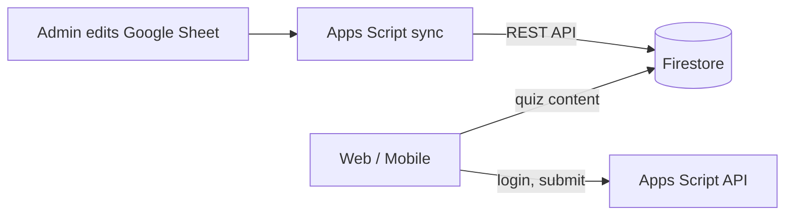

# Firestore hybrid on Spark (free plan)

Use **Firestore** as the app’s quiz database without upgrading to **Blaze**. Sync runs entirely from **Apps Script** — no Cloud Functions.



---

## Org policy blocks service account keys?

If you see:

> *Key creation is not allowed on this service account*

your Google Workspace organisation blocks downloading JSON keys. **Use user OAuth instead** (no key file needed).

| Method | Service account key | Works with org policy |
|--------|---------------------|------------------------|
| **User OAuth** (recommended) | Not needed | Yes |
| Service account key | Required | No |

---

## Setup — User OAuth (no service account key)

### 1. Enable Firestore

1. [Firebase Console](https://console.firebase.google.com) → **bbadublin-quiz**
2. **Build → Firestore Database → Create database**
3. Location: **europe-west1**, mode: **Production**

### 2. Deploy security rules

```powershell
firebase deploy --only firestore
```

### 3. Add your Google account to the Firebase project

Your Apps Script runs **as you**, so you need permission to write Firestore:

1. Firebase Console → **Project settings → Users and permissions**
2. **Add member** → your email (same account that owns/edits the Sheet)
3. Role: **Editor** (or at minimum **Cloud Datastore User** in [Google Cloud IAM](https://console.cloud.google.com/iam-admin/iam))

### 4. Settings sheet rows

| key | value |
|-----|-------|
| `firebase_project_id` | `bbadublin-quiz` |
| `firestore_auth_mode` | `user` |

### 5. Copy Apps Script files

Copy into your Apps Script project:

- `gas/appsscript.json` (adds Firestore OAuth scope — **important**)
- `gas/FirestoreRest.gs`
- `gas/FirestoreSync.gs`

After updating `appsscript.json`, Google will ask you to **re-authorize** the script.

### 6. Authorize Firebase access

In the Google Sheet:

**BBA Quiz → Authorize Firebase access**

Approve the new permission when prompted (access to Cloud Datastore / Firestore).

### 7. Test & sync

**BBA Quiz → Test Firebase connection**  
**BBA Quiz → Sync quiz data to Firestore**

### 8. Optional: 15-minute auto-sync

**BBA Quiz → Install 15-min Firestore sync (Apps Script)**

The trigger runs as **your account** — keep Editor access on the Firebase project.

---

## Setup — Service account key (if your org allows it)

Skip this section if key creation is blocked.

1. Firebase Console → **Service accounts → Generate new private key**
2. Apps Script → **Script properties**:

| Property | Value |
|----------|-------|
| `FIREBASE_CLIENT_EMAIL` | from JSON |
| `FIREBASE_PRIVATE_KEY` | PEM from JSON |

3. Settings sheet:

| key | value |
|-----|-------|
| `firebase_project_id` | `bbadublin-quiz` |
| `firestore_auth_mode` | `service_account` |

---

## View / edit Firestore data

1. [Firebase Console](https://console.firebase.google.com)
2. Project **bbadublin-quiz**
3. **Build → Firestore Database → Data**

| Collection | Example doc |
|------------|-------------|
| `questions` | `en_quiz-001_1` |
| `answerKeys` | `en_quiz-001_1` |
| `schedule` | `2026-07-14` |
| `quizzes` | `quiz-001` |
| `syncMeta` | `latest` |

Edit questions in the **Google Sheet**, then sync. Use the Console to inspect data.

---

## Troubleshooting

| Error | Fix |
|-------|-----|
| Key creation not allowed | Use `firestore_auth_mode` = `user` (see above) |
| Could not get user OAuth token | Run **Authorize Firebase access**; approve permissions |
| PERMISSION_DENIED | Add your Google account as **Editor** on Firebase project |
| Firestore commit failed | Enable **Cloud Firestore API** in Google Cloud Console → APIs |
| Scheduled sync fails | Re-run **Authorize Firebase access** as the user who installed the trigger |
| Quiz empty after sync | Run sync again; check `questions` collection in Firebase Console |
| Students see sheet fallback | Web app runs as deployer — deployer must **Authorize Firebase access** |

---

## Quiz load from Firestore (automatic)

When `firebase_project_id` is set, the app reads **schedule + questions from Firestore** (faster). Login/submit still use the Sheet.

| Settings `quiz_data_source` | Behaviour |
|-----------------------------|-----------|
| `auto` (default) | Firestore when configured, else Sheet |
| `firestore` | Firestore only |
| `sheet` | Sheet only |

Quiz API responses include `"dataSource": "firestore"` when Firestore was used.

---

## Spark vs Blaze sync

| Method | Plan | Auth |
|--------|------|------|
| **Apps Script user OAuth** | Spark | Your Google account |
| Apps Script service account | Spark | JSON key (if org allows) |
| Cloud Function URL | Blaze | `firestore_sync_url` in Settings |

---

## Free tier limits

Firestore on Spark is enough for a church quiz app (~50K reads / 20K writes per day).

---

See also: [FIRESTORE-HYBRID.md](./FIRESTORE-HYBRID.md) for the full schema.
