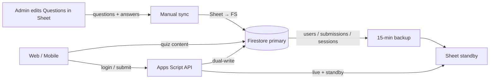

# Firestore hybrid on Spark (free plan)

**Firestore is primary.** Google Sheet is standby (backup) for runtime data, and the **authoring** place for questions/answers.



| Data | Direction | When |
|------|-----------|------|
| Questions + answers (+ schedule) | **Sheet → Firestore** | **Manual** only |
| Users, submissions, sessions | **Firestore → Sheet** | Every **15 minutes** (standby) |

---

## Org policy blocks service account keys?

If you see:

> *Key creation is not allowed on this service account*

your Google Workspace organisation blocks downloading JSON keys. **Use user OAuth instead** (no key file needed).

| Method | Service account key | Works with org policy |
|--------|---------------------|------------------------|
| **User OAuth** (recommended) | Not needed | Yes |
| Service account key | Required | No |

---

## Setup — User OAuth (no service account key)

### 1. Enable Firestore

1. [Firebase Console](https://console.firebase.google.com) → **bbadublin-quiz**
2. **Build → Firestore Database → Create database**
3. Location: **europe-west1**, mode: **Production**

### 2. Deploy security rules

```powershell
firebase deploy --only firestore
```

### 3. Add your Google account to the Firebase project

1. Firebase Console → **Project settings → Users and permissions**
2. **Add member** → your email (same account that owns/edits the Sheet)
3. Role: **Editor**

### 4. Settings sheet rows

| key | value |
|-----|-------|
| `firebase_project_id` | `bbadublin-quiz` |
| `firestore_auth_mode` | `user` |
| `quiz_data_source` | `firestore` |

### 5. Copy Apps Script files

Copy into your Apps Script project:

- `gas/appsscript.json`
- `gas/FirestoreRest.gs`
- `gas/FirestoreSync.gs`
- `gas/FirestoreRuntime.gs`
- `gas/FirestoreBackup.gs`
- Updated `Setup.gs`, `Quiz.gs`, `Auth.gs`, `Config.gs`

### 6. Authorize Firebase access

**BBA Quiz → Authorize Firebase access**

### 7. Sync questions (manual)

**BBA Quiz → Sync questions to Firestore (manual)**

Edit questions in the Sheet, then run this after each content update. There is **no** auto sync for questions.

### 8. Migrate runtime data (once)

**BBA Quiz → Migrate runtime data to Firestore**

Copies existing Users / Submissions / Sessions into Firestore.

### 9. Install 15-minute standby backup

**BBA Quiz → Install 15-min Firestore → Sheet backup**

This:
- Removes any old Sheet → Firestore auto-sync triggers
- Backs up Users / Submissions / Sessions from Firestore → Sheet every 15 minutes

To stop all auto jobs: **Remove auto sync / backup triggers**

Run **Backup Firestore → Sheet now** anytime to refresh the standby copy immediately.

---

## Setup — Service account key (if your org allows it)

Skip this section if key creation is blocked.

1. Firebase Console → **Service accounts → Generate new private key**
2. Apps Script → **Script properties**:

| Property | Value |
|----------|-------|
| `FIREBASE_CLIENT_EMAIL` | from JSON |
| `FIREBASE_PRIVATE_KEY` | PEM from JSON |

3. Settings sheet:

| key | value |
|-----|-------|
| `firebase_project_id` | `bbadublin-quiz` |
| `firestore_auth_mode` | `service_account` |
| `quiz_data_source` | `firestore` |

---

## View / edit Firestore data

1. [Firebase Console](https://console.firebase.google.com)
2. Project **bbadublin-quiz**
3. **Build → Firestore Database → Data**

| Collection | Source of truth | Sync |
|------------|-----------------|------|
| `questions` / `answerKeys` | Sheet (authoring) | Manual Sheet → FS |
| `schedule` / `quizzes` | Sheet (with questions sync) | Manual Sheet → FS |
| `users` / `submissions` / `sessions` | Firestore (runtime) | 15-min FS → Sheet standby |

---

## Troubleshooting

| Error | Fix |
|-------|-----|
| Key creation not allowed | Use `firestore_auth_mode` = `user` |
| Could not get user OAuth token | Run **Authorize Firebase access** |
| PERMISSION_DENIED | Add your Google account as **Editor** on Firebase |
| Exceeded maximum execution time | **Continue Firestore sync** |
| Old auto sync still running | **Remove auto sync / backup triggers**, then install the backup trigger |
| Students see sheet fallback | Deployer must **Authorize Firebase access**; set `quiz_data_source` = `firestore` |

---

## Quiz load

| Settings `quiz_data_source` | Behaviour |
|-----------------------------|-----------|
| `firestore` (default) | Firestore primary |
| `auto` | Firestore when configured |
| `sheet` | Sheet standby only |

### Runtime (login / submit)

After **Migrate runtime data to Firestore**, login and submit read **Users / Sessions / Submissions from Firestore first** (direct document lookups). Sheet is dual-written as standby and refreshed by the 15-minute backup.

| Action | Fast path |
|--------|-----------|
| Password login | `users/{emailId}` get |
| Session check | `sessions/{tokenId}` get + cached profile |
| Quiz lock / submit check | `submissions/{email_date}` get |

OTP codes still use the OTP sheet (short-lived).

---

See also: [FIRESTORE-HYBRID.md](./FIRESTORE-HYBRID.md)
